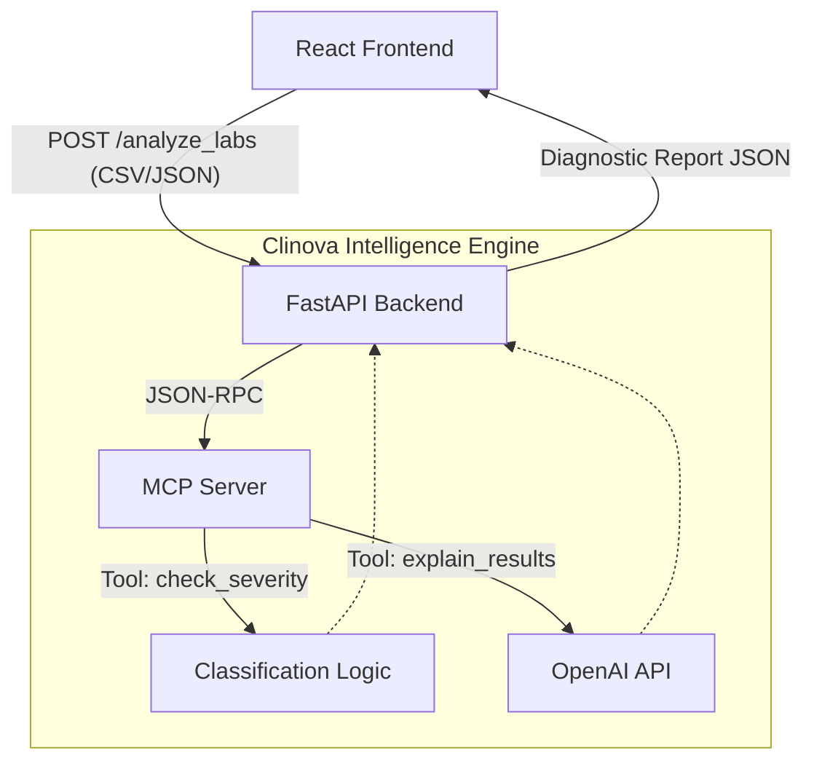

<div align="center">
  
  <h1>Clinova 🧬</h1>
  <p><strong>Clinical Intelligence, Reimagined.</strong></p>
  <p>A next-generation pharmaceutical intelligence platform for analyzing blood panels, urine screenings, and toxicology reports with Explainable AI and Model Context Protocol (MCP).</p>

  <p>
    
    
    
    
    
  </p>
</div>

<hr/>

## 🌐 Live Demo

- **Frontend (Vercel)**: [https://lablens-ashen.vercel.app](https://lablens-ashen.vercel.app)
- **Backend API (Render)**: [https://lablens-backend.onrender.com](https://lablens-backend.onrender.com)

---

## ✨ Key Features

- 🔬 **Clinical Analysis Workbench**: A premium, responsive interface inspired by modern pharmaceutical laboratories, featuring dark-mode aesthetics and fluid CSS animations.
- 🚥 **Severity Classification Engine**: Automatically evaluates results against reference ranges and flags them as **Normal**, **Warning**, or **Critical**.
- 🧠 **Explainable AI Insights**: Powered by OpenAI's `gpt-4o-mini`, providing plain-English clinical interpretation and recommended next steps for abnormal results.
- ⚗️ **Toxicology & Drug Screening**: Dedicated presentation for drug screens (e.g., THC, Cocaine, Opiates) detailing Presumptive Positive/Negative status and recommending confirmation testing when required.
- 📄 **Batch Processing & Manual Entry**: Upload full lab reports via CSV with automatic parsing, or enter singular test data manually.
- 📊 **Dynamic Data Visualization**: Interactive clinical reference gauges and severity-coded data grids.

---

## 📂 Repository Structure

The project is organized into a completely decoupled Frontend and Backend, connected via a REST API.

```text
Clinova/
├── backend/                  # Python FastAPI Backend & AI Orchestration
│   ├── main.py               # FastAPI application entry point & API routes
│   ├── mcp_server.py         # Internal Model Context Protocol (MCP) Server
│   ├── models.py             # Pydantic schemas (LabResult, AnalysisResponse)
│   ├── test_openai.py        # Sandbox for testing LLM connectivity
│   └── .env                  # Environment variables (OPENAI_API_KEY)
│
├── frontend/                 # React + Vite Frontend Workspace
│   ├── index.html            # HTML entry point
│   ├── package.json          # Node dependencies
│   ├── src/                  
│   │   ├── main.jsx          # React DOM mounting
│   │   ├── index.css         # Global design tokens (Colors, Fonts, Animations)
│   │   ├── App.jsx           # App shell, state machine & routing orchestration
│   │   ├── App.css           # Shell & layout styles
│   │   └── components/       # UI Component Library
│   │       ├── PharmaHero.jsx      # Animated landing page / input gateway
│   │       ├── LabInput.jsx        # Drag-and-drop CSV & manual entry forms
│   │       ├── ResultsDisplay.jsx  # Diagnostic rendering (Gauges, Tox-grid, AI Insights)
│   │       ├── SeverityBadge.jsx   # Dynamic severity status indicators
│   │       └── ...css              # Component-scoped styling
│
└── test_data/                # Sample CSV datasets for testing batch processing
    ├── dataset1.csv          # Routine blood panels (CBC, CMP)
    ├── dataset2.csv          # Endocrinology & Lipid panels
    └── dataset3.csv          # Toxicology & Drug Screenings
```

---

## 📐 Architecture & Data Flow

Clinova utilizes an advanced architecture where the backend acts as an orchestrator, leveraging an integrated **Model Context Protocol (MCP)** server to equip the AI with specialized diagnostic tools.



### 🧠 How the AI Engine Works
1. **Data Ingestion**: Lab results are passed to the FastAPI backend.
2. **Context Assembly**: The backend calls the internal MCP Server, requesting it to analyze the lab values against standard reference ranges using the `check_severity` tool.
3. **AI Inference**: For abnormal or complex results, the MCP Server invokes the `explain_results` tool, sending the clinical context to OpenAI (`gpt-4o-mini`).
4. **Structured Output**: The AI returns a structured explanation and recommended next clinical steps, which is compiled and sent back to the frontend.

---

## 🛠️ Technology Stack

### Frontend
* **React + Vite**: For a lightning-fast development experience and optimized builds.
* **Vanilla CSS (No Tailwind)**: A fully custom, token-based design system tailored for a unique "pharmaceutical workbench" aesthetic. Utilizes CSS variables, flexbox/grid, and complex keyframe animations.
* **PapaParse**: High-performance client-side CSV parsing.
* **Lucide React**: Clean, modern iconography.

### Backend
* **Python FastAPI**: Asynchronous web framework for high-throughput API routing.
* **Model Context Protocol (MCP)**: Standardized context pipeline for integrating external tools with LLMs.
* **OpenAI API**: For generating rich clinical insights and reasoning.
* **Pydantic**: Strict schema validation for robust API contracts.

---

## 🚀 Getting Started

### Prerequisites
- [Node.js](https://nodejs.org/) (v16+)
- [Python](https://www.python.org/) (3.9+)
- [OpenAI API Key](https://platform.openai.com/)

### 1. Backend Setup

```bash
# Navigate to the backend directory
cd backend

# Create and activate a virtual environment
python -m venv venv
source venv/bin/activate  # Windows: venv\Scripts\activate

# Install dependencies
pip install fastapi uvicorn mcp python-dotenv pydantic openai

# Create environment file and add your API key
echo "OPENAI_API_KEY=your_key_here" > .env

# Start the server (runs on port 8000 by default)
uvicorn main:app --reload --port 8000
```

### 2. Frontend Setup

```bash
# Open a new terminal and navigate to the frontend directory
cd frontend

# Install dependencies
npm install

# Start the Vite development server
npm run dev
```

### 3. Usage

1. Open `http://localhost:5173` in your browser.
2. The platform will boot into the **Pharmaceutical Intelligence Shell**.
3. Choose to either:
   * **Upload a CSV report** (use the provided `test_data/` files).
   * **Enter results manually** (e.g., Test: Hemoglobin, Result: 9.2, Unit: g/dL, Ref: 12-16).
4. Watch the Analysis Pipeline classify the data and fetch AI interpretations.
5. Review the resulting **Clinical Dashboard**, interact with the reference gauges, and review the AI-generated recommended clinical actions.

---

<div align="center">
  <p>Built with precision for the modern laboratory workspace.</p>
</div>
