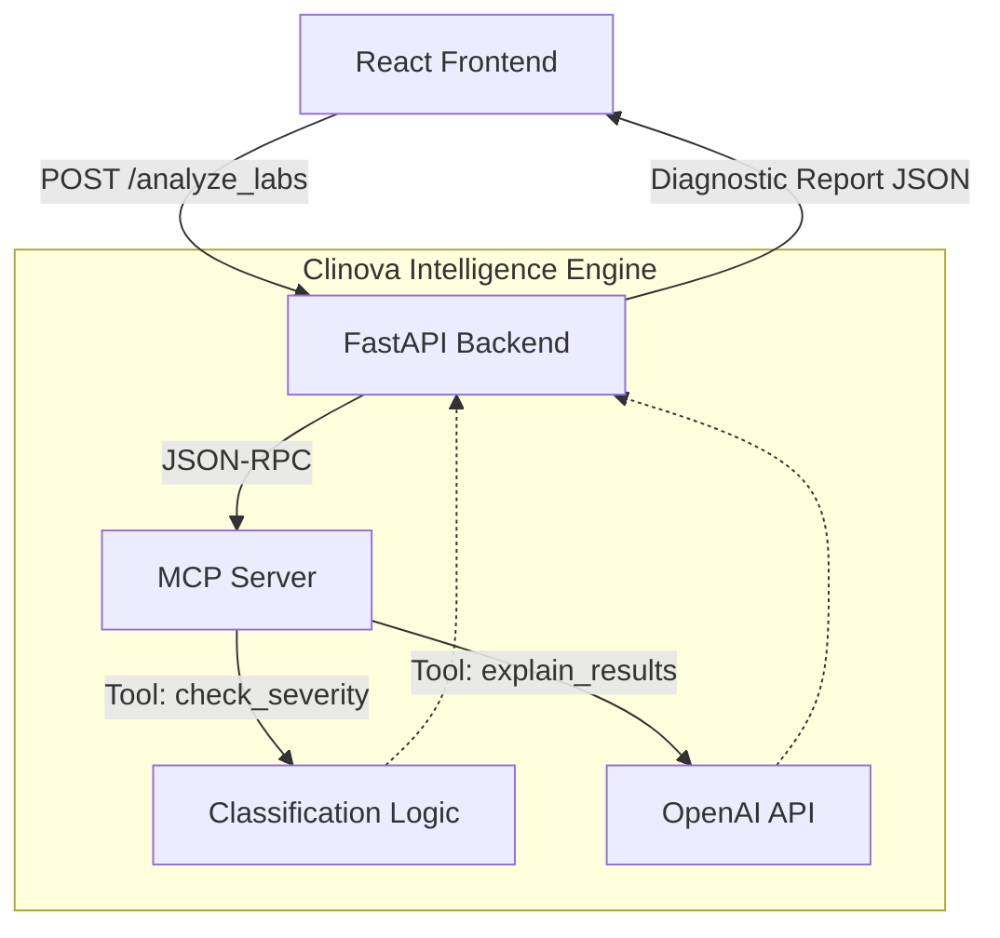

<div align="center">
  
  <h1>Clinova 🧬</h1>
  <p><strong>Clinical Intelligence, Reimagined.</strong></p>
  <p>A next-generation pharmaceutical intelligence platform for analyzing blood panels, urine screenings, and toxicology reports with Explainable AI and Model Context Protocol (MCP).</p>

  <p>
    
    
    
    
    
  </p>
</div>

<hr/>

## ✨ Key Features

- 🔬 **Clinical Analysis Workbench**: A premium, responsive interface inspired by modern pharmaceutical laboratories.
- 🚥 **Severity Classification Engine**: Automatically evaluates results against reference ranges and flags them as **Normal**, **Warning**, or **Critical**.
- 🧠 **Explainable AI Insights**: Powered by OpenAI's `gpt-4o-mini`, providing plain-English clinical interpretation and recommended next steps for abnormal results.
- ⚗️ **Toxicology & Drug Screening**: Dedicated presentation for drug screens (e.g. THC, Cocaine, Opiates) detailing Presumptive Positive/Negative status and recommending confirmation testing when required.
- 📄 **Batch Processing**: Upload full lab reports via CSV, or enter singular test data manually.
- 🔌 **Model Context Protocol (MCP)**: The backend utilizes an internal MCP server to expose reference databases and LLM capabilities in a standardized way.

## 📐 Architecture

Clinova utilizes a decoupled architecture where a React/Vite frontend talks to a FastAPI backend. The backend acts as an orchestrator, leveraging an integrated MCP server for specialized diagnostic tools.



## 🛠️ Technology Stack

### Frontend
* **React + Vite**: For a lightning-fast development experience and optimized builds.
* **Vanilla CSS**: Fully custom, token-based design system featuring fluid animations, dark mode capabilities, and a responsive pharmaceutical aesthetic (No Tailwind/Bootstrap overhead).
* **PapaParse**: High-performance client-side CSV parsing.
* **Lucide React**: Clean, modern iconography.

### Backend
* **Python FastAPI**: Asynchronous web framework for high-throughput API routing.
* **Model Context Protocol (MCP)**: Standardized context pipeline for the AI agent.
* **OpenAI API**: For generating rich clinical insights and reasoning.
* **Pydantic**: Strict schema validation for inputs and outputs.

---

## 🚀 Getting Started

### Prerequisites
- [Node.js](https://nodejs.org/) (v16+)
- [Python](https://www.python.org/) (3.9+)
- [OpenAI API Key](https://platform.openai.com/)

### 1. Backend Setup

```bash
# Navigate to the backend directory
cd backend

# Create and activate a virtual environment
python -m venv venv
source venv/bin/activate  # Windows: venv\Scripts\activate

# Install dependencies
pip install fastapi uvicorn mcp python-dotenv pydantic openai

# Create environment file and add your API key
echo "OPENAI_API_KEY=your_key_here" > .env

# Start the server (runs on port 8001 by default)
uvicorn main:app --reload --port 8001
```

### 2. Frontend Setup

```bash
# Open a new terminal and navigate to the frontend directory
cd frontend

# Install dependencies
npm install

# Start the Vite development server
npm run dev
```

### 3. Usage

1. Open `http://localhost:5173` in your browser.
2. The platform will boot into the **Pharmaceutical Intelligence Shell**.
3. Choose to either:
   * **Upload a CSV report** (sample datasets provided in `test_data/`)
   * **Enter results manually** (e.g., Test: Hemoglobin, Result: 9.2, Unit: g/dL, Ref: 12-16)
4. Watch the Analysis Pipeline classify the data and fetch AI interpretations.
5. Review the resulting **Clinical Dashboard**, complete with reference gauges and toxicology chain-of-analysis.

---

## 🧪 Included Test Data

For testing the batch upload functionality, use the provided CSV datasets in the `test_data/` directory:
- `dataset1.csv` - Routine blood panel (CBC, CMP)
- `dataset2.csv` - Endocrinology & Lipid panel
- `dataset3.csv` - Toxicology & Drug Screenings

---
<div align="center">
  <p>Built with precision for the modern laboratory workspace.</p>
</div>
